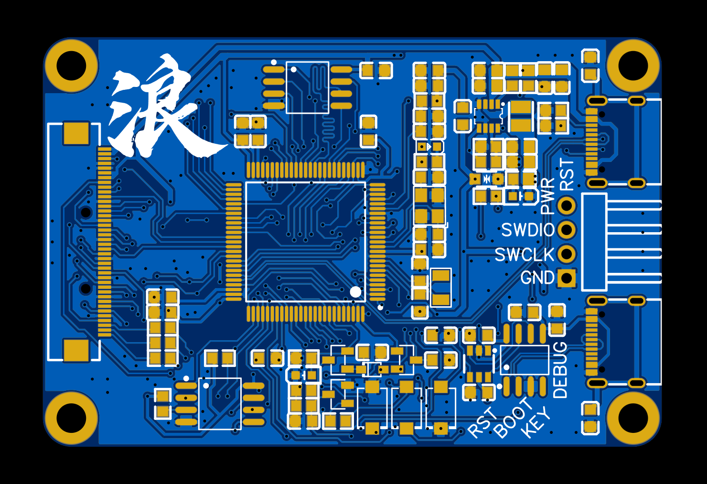
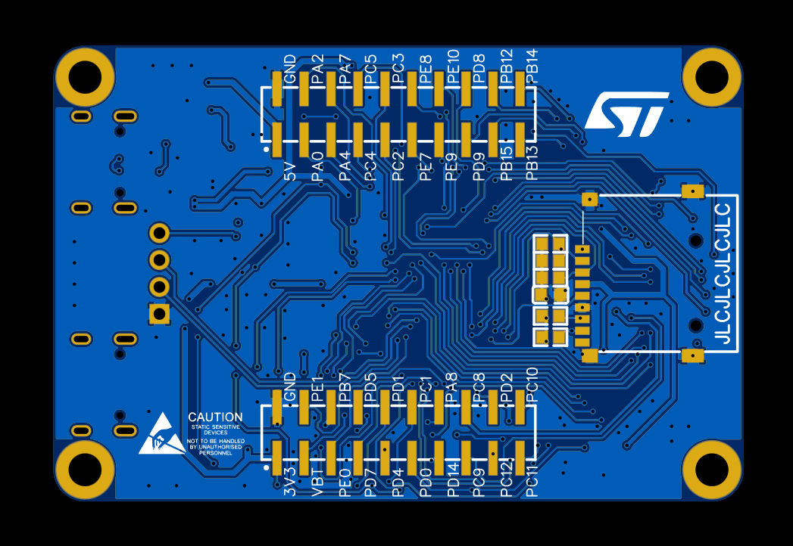

## STM32H750VBT6 核心板

### 原作信息

- 作者：[憂鬱的樹袋熊](https://space.bilibili.com/14536820)
- 立创开源广场：[仿制反客科技STM32H750VBT6核心板](https://oshwhub.com/yydsdx/stm32h750vbt6_gfx)
- 焊接测试视频：[焊个板板，好烫烫！！！ STM32H750开发板](https://www.bilibili.com/video/BV1jU4y1M7GA?share_source=copy_web&vd_source=e6ad3ca74f59d33bf575de5aa7ceb52e)

### 关于

- 两层板设计，过孔0.3/0.5，最小线宽线隙5mil

- 使用贴片双排2.54mm排针排母连接，类似BTB结构

- 从反客科技的板子修改（两个Flash、RGB屏液晶接口、3个按键（复位、BOOT、用户）、1个用户LED、1个TF卡、串口、SWD接口一个都不少）

- 采用MP2144 1.5A DCDC供电3.3V，替代反客科技的SOT-89封装的LDO

- PCB尺寸：65mmx43mm

  孔距：59mx37mm

  两组2x10pin排针：关于板子中心对称，Y方向距离15mm，x坐标为板长中线32.5mm

### 修改部分

> 原作版布线十分潇洒，但德国精工觉得还可以优化，遂做了以下修改

- 更改同步降压DCDC芯片MP2144的布局，与MPS官方手册一致，电感封装由2016改为2520

- 优化大部分走线与焊盘间的45度夹角

- 调整部分盘下孔位置

- 修改固定孔，可完美安装M3 304薄头内六角螺丝

- 更改SWD调试接口的pin顺序

  > （顺序由上到下）
  >
  > 原版为 GND、RST、SWDIO、SWCLK
  >
  > 修改后的顺序为RST、SWDIO、SWCLK、GND
  >
  > 与Blue Pill或者Black Pill的SWD接口：GND、SCK、DIO、3V3为逆向，但3V3换为RST，（实际通过一个10K电阻串联H750的RST）
  >
  > 因此可以直连mini ST-link的4脚：3V3、DIO、SCK、GND

- 更改SN74LVC2G17的封装，从SC-70改为SOT23-6，因为前者涨价了十几倍，后者1元不到
- 更改正面竖向丝印的朝向、位置等，背面丝印添加信仰LOGO

### 修改版图片

|  |  |
| ------------------------------------------------------------ | ------------------------------------------------------------ |

