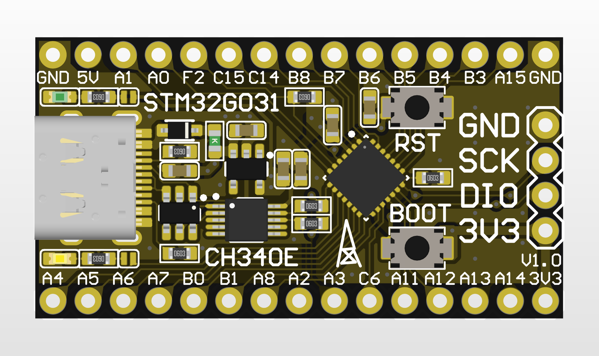
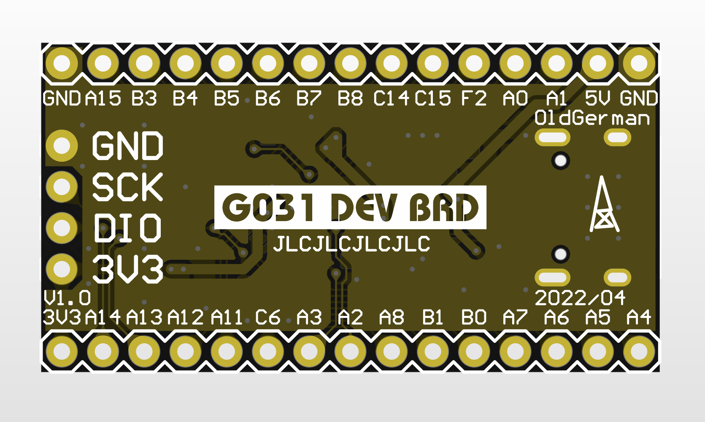
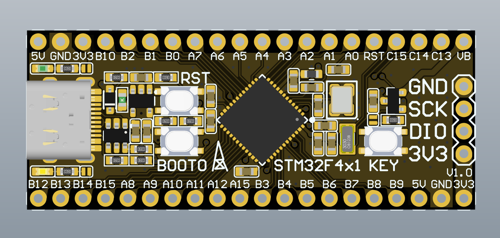
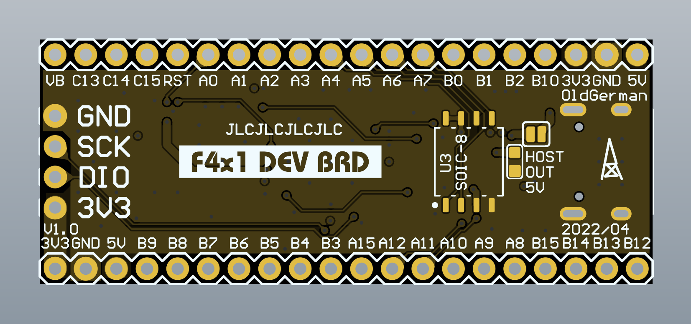
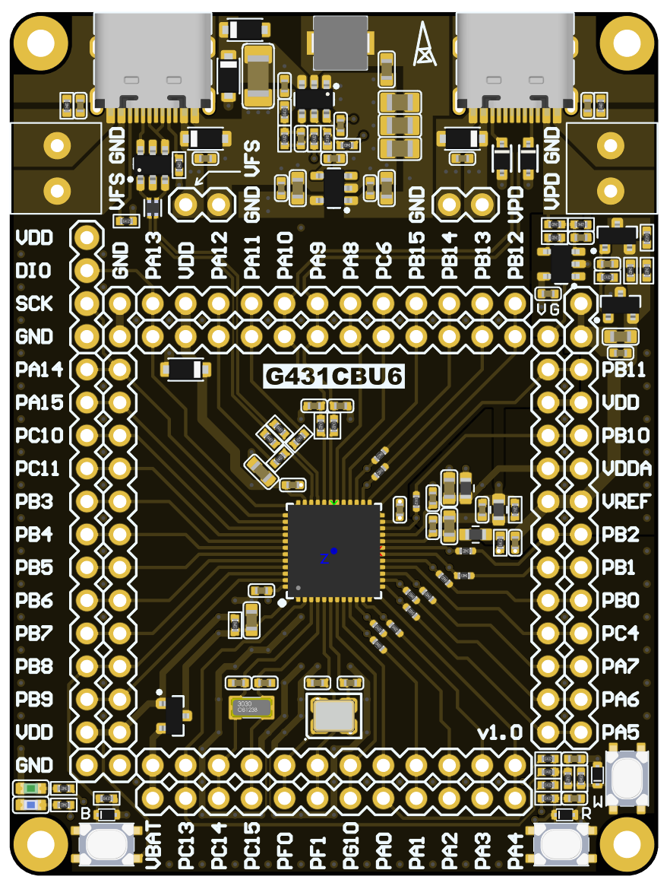
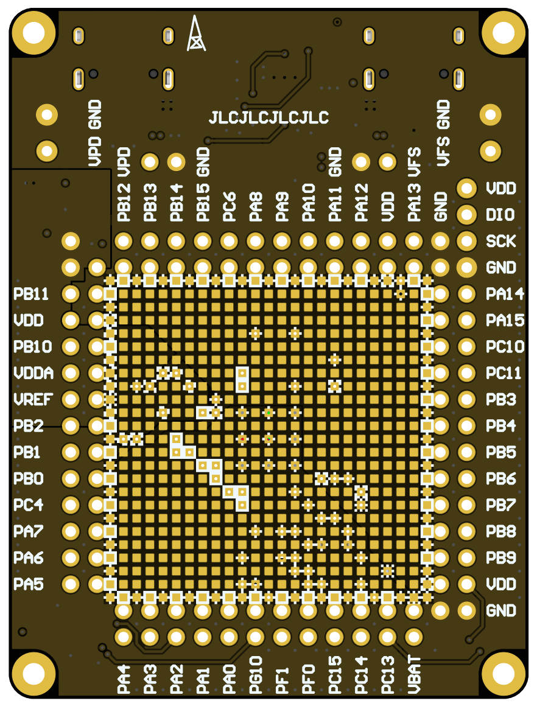
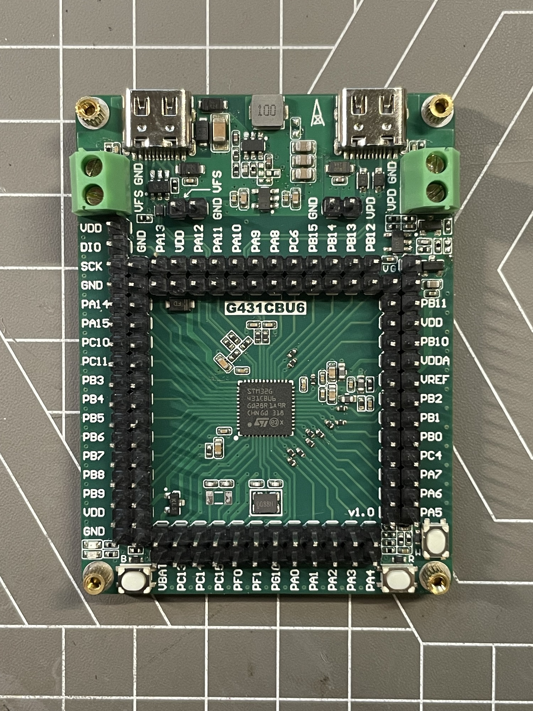

# STM32-DEV-BRD

（白嫖失败血压升高后）整的几片考究的STM32最小系统板，~~清一色0603~~，确保食用舒适

PCB工程完全开源，提供测试程序，焊接后第一时间可刷入测试

## 型号

- 💚：完工并已验证
- :yellow_heart:：完工但未验证
- :x:：还没画板子

| 更新日期   | 状态           | 开发板型号                                                   | 支持芯片                                                 | PCB层数 |
| ---------- | -------------- | ------------------------------------------------------------ | -------------------------------------------------------- | ------- |
| 2022/04/29 | 💚              | [G031 DEV BRD](https://github.com/oldgerman/STM32-DEV-BRD/tree/master/G031_Dev) | STM32G031G8Ux                                            | 2       |
| 2022/04/29 | 💚              | [F4x1 DEV BRD](https://github.com/oldgerman/STM32-DEV-BRD/tree/master/F4x1_Dev) | STM32F401CxUx STM32F411CxUx                         | 4       |
| 2022/07/31 | :yellow_heart: | [H7xxVxT6_LANG](https://github.com/oldgerman/STM32-DEV-BRD/tree/master/H7xxVxT6_LANG) | （LQFP100） STM32H750 STM32H743 STM32H7B0 | 2       |
| ?          | :x:            | F07x DEV BRD                                                 | STM32F071CxUx STM32F072CxUx                         | ?       |
| ?          | :x:            | F103 DEV BRD                                                 | STM32F103CxUx                                            | ?       |
| 2024/02/29 | 💚              | [G431 DEV BRD](https://github.com/oldgerman/STM32-DEV-BRD/tree/master/G431_Dev) | STM32G431GBUx                                            | 4       |
| ?          | ...            | （不定期更新）                                               |                                                          |         |

## PCB

| 开发板型号   | Top                                                          | Bottom                                                       |
| ------------ | ------------------------------------------------------------ | ------------------------------------------------------------ |
| G031 DEV BRD |  |  |
| F4x1 DEV BRD |  |  |
| G431 DEV BRD |  |  |

## 图片

.jpeg)

